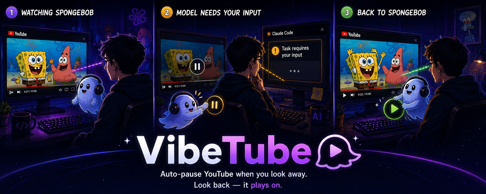

  

# VibeTube

Auto-pause YouTube when you look away from the screen. Look back — it plays again.

Built for juggling a bunch of tasks at once across multiple monitors — video lives on one screen, work on the others.

Especially handy for **vibecoders**: while the model is doing its thing, you watch videos. Model asks a question — you turn to the chat to reply, the video pauses on its own. Reply sent, glance back — it's playing again.

## What it does

- Look away for ~4 seconds → pause. Look back → plays
- Manual pause/play (click, spacebar) always wins
- Eye icon in the player toggles it on/off. State persists across sessions
- Face detection runs locally via [pico.js](https://github.com/nenadmarkus/picojs)

## Install

1. Install [Tampermonkey](https://www.tampermonkey.net/) in your browser
2. Open this link: **[vibetube.user.js](https://raw.githubusercontent.com/NIK-TIGER-BILL/vibetube/main/vibetube.user.js)** — Tampermonkey will offer to install
3. Open any YouTube video → click the eye icon in the player controls → grant camera permission

Tampermonkey auto-pulls updates from this repo.

## Privacy

Everything runs locally in your browser.

- No frames, no detections, no telemetry leave your machine
- One network request total — fetching the face-detection cascade from jsDelivr (a CDN). After that, zero traffic
- The camera stream is consumed only by the built-in detector and (optionally) the preview window

You can read it yourself — it's ~700 lines of plain JavaScript in [vibetube.user.js](./vibetube.user.js).

## Controls

Two icons appear on the right side of the player controls:

| Icon | What it does |
|---|---|
| Camera | Show/hide the preview window (160×120 in the bottom-right — what the detector sees) |
| Eye | Toggle VibeTube on/off |

Green dot on the eye = face detected (video is playing / will resume). Yellow = no face (video will pause in a few seconds).

## License

MIT — see [LICENSE](./LICENSE).
